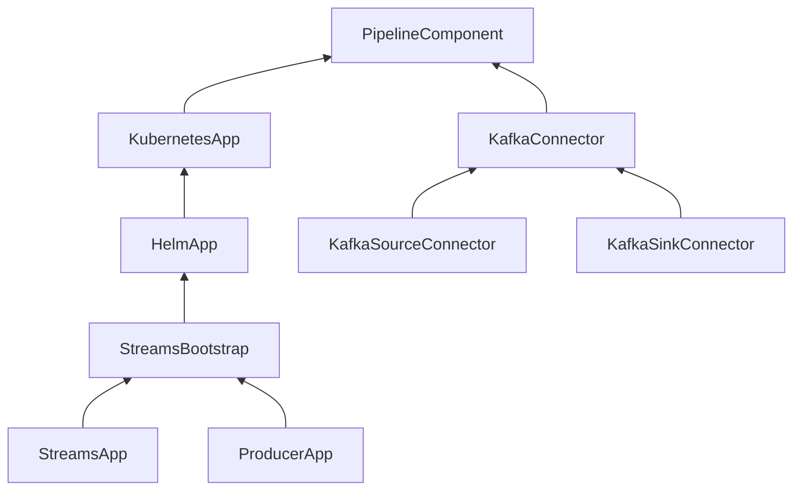

```mermaid
flowchart BT
    KubernetesApp --> PipelineComponent
    HelmApp --> KubernetesApp
    StreamsBootstrap --> HelmApp
    StreamsApp --> StreamsBootstrap
    ProducerApp --> StreamsBootstrap
    KafkaConnector --> PipelineComponent
    KafkaSourceConnector --> KafkaConnector
    KafkaSinkConnector --> KafkaConnector

    click KubernetesApp "./../kubernetes-app"
    click HelmApp "./../helm-app"
    click StreamsBootstrap "./../streams-bootstrap"
    click StreamsApp "./../streams-app"
    click ProducerApp "./../producer-app"
    click KafkaConnector "./../kafka-connector"
    click KafkaSourceConnector "./../kafka-source-connector"
    click KafkaSinkConnector "./../kafka-sink-connector"
```

<i>KPOps component hierarchy</i>

