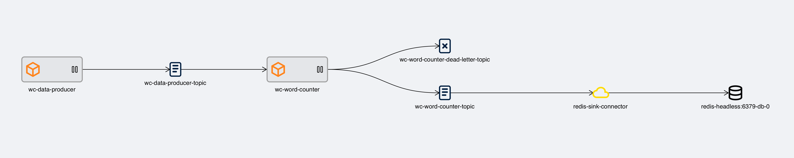

# Quick start

## Word-count

Word-count is a demo pipeline consisting of a producer producing words to Kafka, a Kafka streams app counting the number of times each word occurs, and finally a Redis database into which the words are exported.

## What this will demonstrate

- Deploying a Redis database using Helm
- Deploying a pipeline using KPOps
- Destroying a pipeline using KPOps

## Prerequisites

Completed all steps in the [setup](../setup).

## Setup and deployment

### Redis

Deploy Redis using the [Bitnami Helm chart:](https://artifacthub.io/packages/helm/bitnami/redis){target=_blank}
Add the Helm repository:

```shell
helm repo add bitnami https://charts.bitnami.com/bitnami && \
helm repo update
```

Install Redis with Helm:

```shell
helm upgrade --install -f ./values-redis.yaml \
--namespace kpops \
redis bitnami/redis
```

<!-- dprint-ignore-start -->

??? example "Redis example Helm chart values (`values-redis.yaml`)"
    ```yaml
    architecture: standalone
    auth:
      enabled: false
    master:
      count: 1
      configuration: "databases 1"
    image:
      tag: 7.0.8
    ```

<!-- dprint-ignore-end -->

### Word-count example pipeline setup

#### Port forwarding

Before we deploy the pipeline, we need to forward the ports of `kafka-rest-proxy` and `kafka-connect`.
Run the following commands in two different terminals.

```shell
kubectl port-forward --namespace kpops service/k8kafka-cp-rest 8082:8082
```

```shell
kubectl port-forward --namespace kpops service/k8kafka-cp-kafka-connect 8083:8083
```

### Deploying the Word-count pipeline

<!-- dprint-ignore-start -->

1. Clone the [kpops-examples repository](https://github.com/bakdata/kpops-examples){target=_blank} and `cd` into the directory.

2. Install KPOps `pip install -r requirements.txt`.

3. Export environment variables in your terminal:

    ```shell
    export DOCKER_REGISTRY=bakdata && \
    export NAMESPACE=kpops
    ```

4. Deploy the pipeline

    ```shell
    kpops deploy word-count/pipeline.yaml --execute
    ```

!!! Note
    You can use the `--dry-run` flag instead of the `--execute` flag and check the logs if your pipeline will be
    deployed correctly.

<!-- dprint-ignore-end -->

### Check if the deployment is successful

You can use the [Streams Explorer](https://github.com/bakdata/streams-explorer){target=_blank} to inspect the deployed pipeline.
To do so, port-forward the service in a separate terminal session using the command below:

```shell
kubectl port-forward -n kpops service/streams-explorer 8080:8080
```

After that open [http://localhost:8080](http://localhost:8080){target=_blank} in your browser.

You should be able to see pipeline shown in the image below:

<figure markdown>
  
  <figcaption>An overview of Word-count pipeline shown in Streams Explorer</figcaption>
</figure>

<!-- dprint-ignore-start -->

!!! Attention
    Kafka Connect needs some time to set up the connector.
    Moreover, Streams Explorer needs a while to scrape the information from Kafka Connect.
    Therefore, it might take a bit until you see the whole graph.

<!-- dprint-ignore-end -->

## Teardown resources

### Redis

Redis can be uninstalled by running the following command:

```shell
helm --namespace kpops uninstall redis
```

### Word-count pipeline

<!-- dprint-ignore-start -->

1. Export environment variables in your terminal.

    ```shell
    export DOCKER_REGISTRY=bakdata && \
    export NAMESPACE=kpops
    ```

2. Remove the pipeline

    ```shell
    kpops clean word-count/pipeline.yaml --verbose --execute
    ```

!!! Note
    You can use the `--dry-run` flag instead of the `--execute` flag and check the logs if your pipeline will be
    destroyed correctly.

!!! Attention
    If you face any issues destroying this example see [Teardown](../teardown) for manual deletion.

<!-- dprint-ignore-end -->

## Common errors

<!-- dprint-ignore-start -->

- `deploy` fails:
    1. Read the error message.
    2. Try to correct the mistakes if there were any. Likely the configuration is incorrect, or the port-forwarding is not working as intended.
    3. Run `clean`.
    4. Run `deploy --dry-run` to avoid having to `clean` again. If an error is dropped, start over from step 1.
    5. If the dry-run is successful, run `deploy`.
- `clean` fails:
    1. Read the error message.
    2. Try to correct the indicated mistakes if there were any. Likely the configuration is incorrect, or the port-forwarding is not working as intended.
    3. Run `clean`.
    4. If `clean` fails, follow the steps in [teardown](../teardown).

<!-- dprint-ignore-end -->
