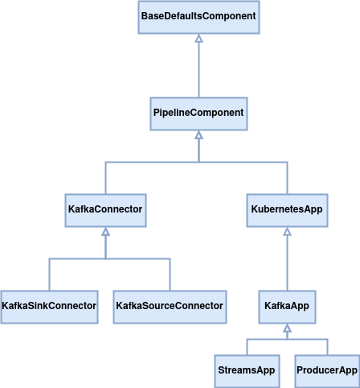

# Overview 

This section explains the different components of KPOps, 
their usage and configuration in the pipeline 
definition [`pipeline.yaml`](../../../resources/pipeline-components/pipeline).

<figure markdown>
  
  <figcaption><i>KPOps component hierarchy</i></figcaption>
</figure>

[See real-world examples of `pipeline.yaml`](../../../resources/examples/pipeline)

<!-- Uncomment when page is created. -->
<!-- To learn more about KPOps' components hierarchy, visit the
[architecture](./docs/developer/architecture/component-inheritance.md) page. -->

!!! note "Environment-specific pipeline definitions"
    Similarly to [defaults](../defaults.md#configuration), it is possible to have an unlimited amount of additional environment-specific 
    pipeline definitions. The naming convention is the same: add a suffix of the form `_{environment}` to the filename.
    Learn more about environments in the [Config](../config.md#__codelineno-0-10) section.
