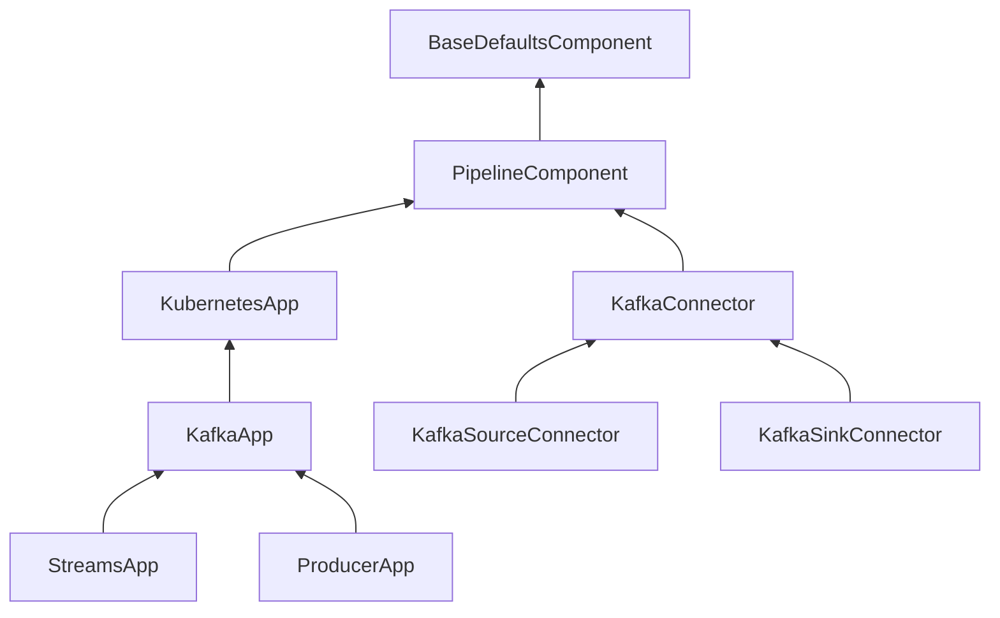

# Overview 

This section explains the different components of KPOps, 
their usage and configuration in the pipeline 
definition [`pipeline.yaml`](../../../resources/pipeline-components/pipeline).

<link rel="stylesheet" href="https://cdnjs.cloudflare.com/ajax/libs/font-awesome/6.4.0/css/all.min.css">

<i>KPOps component hierarchy</i>

<!-- Uncomment when page is created. -->
<!-- To learn more about KPOps' components hierarchy, visit the
[architecture](./docs/developer/architecture/component-inheritance.md) page. -->

