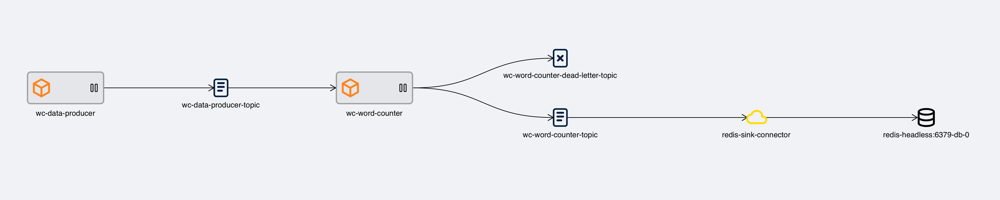

# What is KPOps?

With a couple of easy commands in the shell, and a [`pipeline.yaml`](#example) of under 30 lines, KPOps can not only [`deploy`](./references/cli-commands.md#kpops-deploy) a Kafka pipeline[^1] to a Kubernetes cluster, but also [`reset`](./references/cli-commands.md#kpops-reset), [`clean`](./references/cli-commands.md#kpops-clean) or [`destroy`](./references/cli-commands.md#kpops-destroy) it!

[^1]: A Kafka pipeline can consist of consecutive [streaming applications](./core-concepts/components/streams-app.md), [producers](./core-concepts/components/producer-app.md), and [connectors](./core-concepts/components/kafka-connector.md).

## Key features

- **Deploy Kafka apps to Kubernetes**: KPOps allows to deploy consecutive Kafka Streams applications and producers using an easy-to-read and -write pipeline definition.
- **Manage Kafka Connectors**: KPOps connects with your Kafka Connect cluster and deploys, validates, and deletes your connectors.
- **Configure multiple pipelines and steps**: KPOps has various abstractions that simplify configuring multiple pipelines and steps within pipelines by sharing common configuration between different components, such as producers or streaming applications.
- **Handle your topics and schemas**: KPOps not only creates and deletes your topics but also registers and deletes your schemas.
- **Clean termination of Kafka components**: KPOps removes your pipeline components (i.e., Kafka Streams applications) from the Kubernetes cluster _and_ cleans up the component-related states (i.e., removing/resetting offset of Kafka consumer groups).
- **Preview your pipeline changes**: With the KPOps dry-run, you can ensure your pipeline definition is set up correctly. This helps to minimize downtime and prevent potential errors or issues that could impact your production environment.

## Example

<figure markdown>
  
  <figcaption>An overview of <a href="../getting-started/quick-start">Word-count pipeline</a> shown in <a href="https://github.com/bakdata/streams-explorer#streams-explorer" target="_blank">Streams Explorer</a></figcaption>
</figure>

```yaml title="Word-count pipeline.yaml"
--8<--
https://raw.githubusercontent.com/bakdata/kpops-examples/main/word-count/pipeline.yaml
--8<--
```
